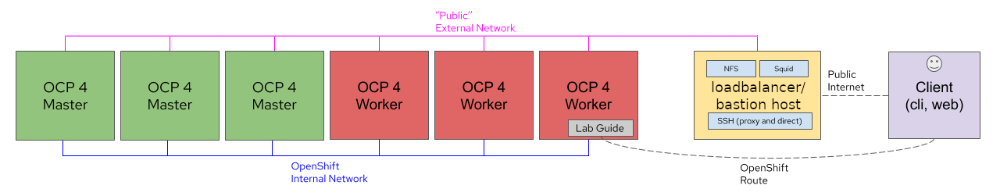

## OpenShift Virtualization Hands-on Lab (Packet Cloud)

**Authors**: [Rhys Oxenham](mailto:roxenham@redhat.com) and [August Simonelli](mailto:asimonel@redhat.com)

**Packet Cloud revision**: [Mike Savage](mailto:savage@redhat.com)

# Welcome!

Welcome to our hands-on OpenShift Virtualization lab for Packet Cloud. 

> **NOTE**: We also have a branch that can be used on your own hardware which includes deployment scripts for a completely self-contained training. This is available from the [main branch of this lab's repo](https://github.com/RHFieldProductManagement/openshift-virt-labs/tree/master).

# Lab environment

The lab includes a self-hosted OpenShift Virtualization environment and a hands-on, self-paced lab guide based on [OpenShift homeroom](https://github.com/openshift-homeroom).

The lab content is presented in three easy to use panes consisting of the following sections: navigation, lab steps, working environment. Adjust sizing to suit!

You'll have access to an OpenShift CLI environment as well as the console.

All labs steps are expected to be run from *within* this environment; you do not need to use the lb/bastion's CLI or login to the OpenShift Console directly, however, utilizing the load-balancer/bastion node can be useful for instances where multiple CLI sessions are desirable.

# Lab content

The lab uses official Red Hat downstream components, where **OpenShift Virtualization** is now the official feature name of the packaged up [Kubevirt project](https://kubevirt.io/) within the OpenShift product. 

The lab runs you through the following OpenShift Virtualization tasks:

* **[Validating the OpenShift deployment](https://github.com/heatmiser/openshift-virt-labs/blob/packet/docs/workshop/content/validation.md)**
* **[Deploying OpenShift Virtualization](https://github.com/heatmiser/openshift-virt-labs/blob/packet/docs/workshop/content/deploy-cnv.md)**
* **[Setting up Storage for OpenShift Virtualization](https://github.com/heatmiser/openshift-virt-labs/blob/packet/docs/workshop/content/storage-setup.md)**
* **[Setting up Networking for OpenShift Virtualization](https://github.com/heatmiser/openshift-virt-labs/blob/packet/docs/workshop/content/network-setup.md)**
* **[Deploying Test Workloads](https://github.com/heatmiser/openshift-virt-labs/blob/packet/docs/workshop/content/deploy-workloads.md)**
* **[Cloning Workloads](https://github.com/heatmiser/openshift-virt-labs/blob/packet/docs/workshop/content/cloning.md)**
* **[Performing Live Migrations and Node Maintenance](https://github.com/heatmiser/openshift-virt-labs/blob/packet/docs/workshop/content/live-migration.md)**
* **[Utilising pod networking for VM's](https://github.com/heatmiser/openshift-virt-labs/blob/packet/docs/workshop/content/masquerade.md)**
* **[Using the OpenShift Web Console with OpenShift Virtualization](https://github.com/heatmiser/openshift-virt-labs/blob/packet/docs/workshop/content/console.md)** 

As mentioned above, the entire environment is deployed within infrastructure hosted by Packet Cloud. This means you can easily deploy the lab, follow some simple setup instructions, and you will have your own bare-metal OpenShift cluster to work on, with full admin access. 

The deployment is visualised as follows:

    

Within this environment you can access all aspects of the lab through the deployed lab guide. You receive details regarding how to access the guide upon completion of the ansible ocp4-workload-cnv automated deployment.

> **NOTE**: For the purposes of this repo and the labs themselves, any reference to "CNV", "Container-native Virtualization" and "OpenShift Virtualization", and "KubeVirt" can be used interchangeably.

### Getting Started

Packet provides full instructions for setting up your account, including your unique username, UID, and passwords.

Here are the details to use them:

1) SSH to the loadbalancer (aka "lb" or bastion host) created for you and port forward your local hosts' port 8080 to the squid port on the bastion (3128)

~~~bash
$ ssh USERNAME@bastion.UID.dynamic.opentlc.com -L 8080:127.0.0.1:3128
~~~

This allows you to connect a browser to local port 8080 and see the "Public" network in the lab.

>**NOTE**: Full SSH connection details, including username, hostname, and password are available via the Packet admin portal.

2) Set your browser (we've tested Firefox and had the most success with this - your mileage may vary with other browsers) to use localhost:8080 for all protocols, and make sure you enable DNS over SOCKSv5 - this avoids any challenges with local DNS:

    

3) Open the URL for the OpenShift Virtualization Lab Workbook via web browser (the "CNV Lab Workbook" value, which looks like https://cnv-workbook.apps.your.unique.domain/)

>**NOTE**: You will need to accept the SSL warnings but you do not need to login to the workbook.

    

### Contributing

**We very much welcome contributions and pull requests!**
